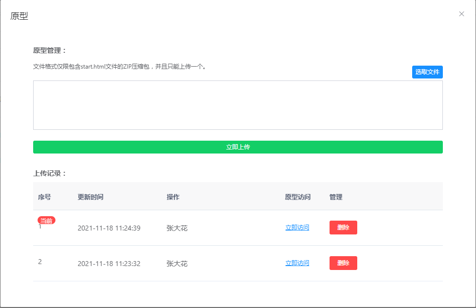

## 平台介绍
   九橡项目管理系统（oak project），是一款轻量级项目管理工具，目前包括工时统计、原型分享两大功能。
   
   - 工时：工时统计可通过员工工时上报的方式，来记录项目所花费的工时，帮助企业进行项目工时统计、核算人工成本。实时、动态、真实的展示项目投入。
   
   - 原型：主要用于开发过程中产品原型的分发和浏览，可直接通过链接访问原型。团队不在需要发送原型文件，或者使用墨刀、其他第三方托管服务。安全、便捷，没有数量限制。原型具有版本管理功能，可查看历史原型。

   

## 软件架构
JAVA 1.8 +  MYSQL 8 +VUE
项目基于前后端分离架构，
服务端：springboot  前端vue。

## 安装步骤
查看安装说明：  [安装说明](https://gitee.com/nineoak/oaker-project/wikis/%E9%83%A8%E7%BD%B2%E6%89%8B%E5%86%8C/%E9%83%A8%E7%BD%B2%E8%AF%B4%E6%98%8E)

## 功能列表
工时模块

1、我的工时：提交工时、查看详情、修改工时。

2、工时统计：统计详情、按月模式、填报详情。

3、项目统计：项目投入进度、项目工时总计、昨天上报、今日上报、上报记录、工时明细、项目详情等。

4、总体统计：人员上报记录、人员上报详情。

原型模块

1、原型管理：原型管理、原型访问、文档管理、文档下载等。

2、文档管理：文档编辑、原型编辑，原型版本管理、原型删除。

管理模块

1、项目管理：创建项目、添加人员、工时设置、状态管理、删除项目。

2、组织管理：用户管理、角色管理、重置密码、批量删除。

3、职位管理：包括筛选、新增、修改、删除、批量删除等功能。

4、成本管理：成本开关、岗位成本设置、人员成本设置。

## 功能截图

首页

我的工时

提交工时

填报记录

项目统计

全部统计

项目填报详情

原型分享

上传原型

## 演示环境
http://test.hdfr.com.cn/
### 开发人员
上报工时，查看原型

用户名： cszh2
密码：123456

### 产品人员
具有原型管理功能

用户名： cszh3
密码：123456

### 项目经理
具有项目统计功能

用户名： cszh1
密码：123456

### 项目总监
具有项目统计，总体查看等功能

用户名： zongjian1
密码：123456

##  后续计划
1、知识库
2、看板
3、甘特图
4、消息提醒

## 问题反馈
1、欢迎大家使用，项目开源免费，无特殊授权要求。

2、交流咨询请加QQ群：336197563。

## 感谢
该项目基于若依、ele-admin-ui等相关框架，在此进行感谢。
