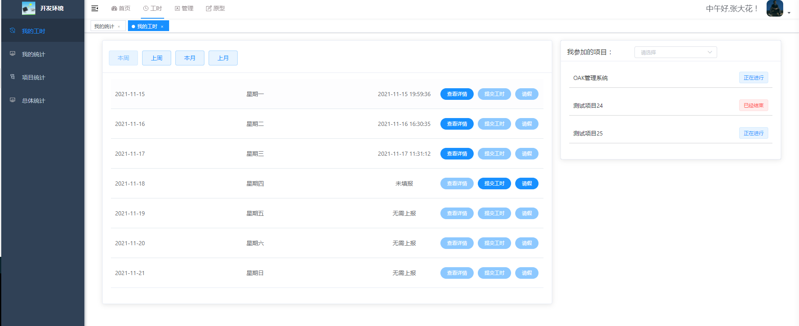
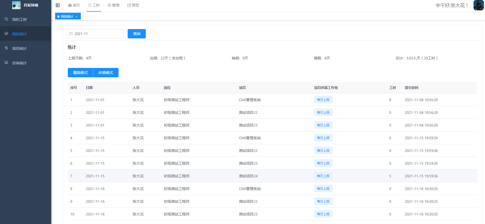

## 平台介绍
   九橡项目工时管理系统（oak project），是一款轻量级项目工时统计系统，可通过员工工时上报的方式，来记录项目所花费的工时，帮助企业进行项目工时统计、核算人工成本。
实时、动态、真实的展示项目投入。

## 软件架构
JAVA 1.8 +  MYSQL 8 +VUE
项目基于前后端分离架构，服务端主要技术：springboot  前端主要是vue。

## 安装步骤
下载代码、编译打包，部署后端服务
部署前端服务（前端代码oaker-admin-ui）
安装数据库

## 功能列表
1、我的工时：提交工时、查看详情、修改工时。

2、工时统计：统计详情、按月模式、填报详情。

3、项目统计：项目投入进度、项目工时总计、昨天上报、今日上报、上报记录、工时明细、项目详情等。

4、原型分享功能：原型管理、原型访问、文档管理、文档下载等。

5、项目管理：创建项目、添加人员、工时设置、状态管理、删除项目。

6、组织管理：用户管理、角色管理、重置密码、批量删除。

7、职位管理：包括筛选、新增、修改、删除、批量删除等功能。

## 功能截图
首页

我的工时

项目管理

工时统计

项目设置

## 演示环境
http://test.hdfr.com.cn/
### 测试账号 - 开发人员-上报工时，查看原型
用户名： cszh2
密码：123456

### 测试账号 - 产品人员-具有原型管理功能
用户名： cszh3
密码：123456

### 测试账号 - 项目经理-具有项目统计功能
用户名： cszh1
密码：123456

## 问题反馈
1、欢迎大家使用，共同开发。
2、QQ技术交流群：336197563

## 感谢
该项目基于若依框架完成，在此进行感谢。